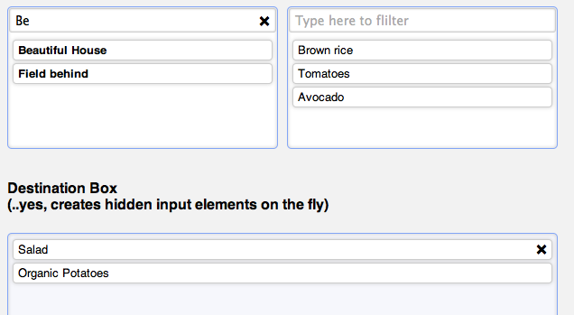

jsMultipleSelect
================
Creates a multiple selection where you can have multiple choice boxes beeing add to one selection.
You can set that the choices are removed after selection, or that you can select one choice multiple times.

How to use
----------
Add mootools core and the jsMultipleSelect.js to your website.
The simplest way to use it is to just call

    #JS

    window.addEvent('domready',function(){

      new jsMultipleSelect();

    });

An have the right HTML in the page.

If you want to customize it you can use the follwing options:

    #JS

    window.addEvent('domready',function(){

      new jsMultipleSelect({
        highlightColor:'#cccccc',
        removeButton: new Element('a',{'html':'remove'}),
        removeButtonClass: 'remove'
      });

    });

  - options:

    highlightColor:  The color which will be used to highlight the selectionDropBox when a element is add (default: "#cedee6")
    removeButton:  The remove link which will be add to the all selected item (default: "new Element('a',{'html':'&#215;'})")
    removeButtonClass: The class which will be add to the remove link

The selection &gt;ul&lt; elements must have the following format.
Each &gt;ul&lt; element with choices must have a "jsMultipleSelect" class.
Each containing &gt;li&lt; element must have a "jsMultipleSelectItem" class.

  Attributes:

  - data-name: this is the name aatribute you inputs will get to post and array through the form, when submited
  - data-jsMultipleSelect: the id of your selections, to connect selections and selectionDropBoxes. Each pair of selections and dropBox must have a unique id.
  - data-value: each li must have this attribute, which contains the value which the created input will get

    #HMTL

    <ul class="jsMultipleSelect" data-name="myInputFieldName" data-jsMultipleSelect="1">
      <li class="filter"><input type="text" placeholder="Type here to filter"></li>

      <li class="jsMultipleSelectItem" data-value="myValue1">Value Name 1</li>
      <li class="jsMultipleSelectItem" data-value="myValue2">Value Name 2</li>
    </ul>